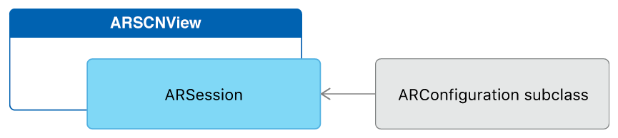

# Audio in ARKit

Places a 3D object on the first plane ARKit detects and uses SceneKit's positional audio feature to locate the object when it is outside of the camera's view finder.

## Overview

This sample app runs an [ARKit][0] world tracking session with content displayed in a SceneKit view. To demonstrate plane detection, the app simply places a 3D model onto the first plane that ARKit detects. If the model's position is outside the current field of view of the camera, the app uses SceneKit's positional audio feature to indicate which direction to turn the device to see the model.

[0]:https://developer.apple.com/documentation/arkit

## Getting Started

ARKit requires iOS 11 and a device with an A9 (or later) processor. ARKit is not available in iOS Simulator. Building the sample code requires Xcode 9 or later.

## Configure and Run the AR Session

The [`ARSCNView`][1] class is a SceneKit view that includes an [`ARSession`][2] object that manages the motion tracking and image processing required to create an AR experience. However, to run a session you must provide a session configuration.

[1]:https://developer.apple.com/documentation/arkit/arscnview
[2]:https://developer.apple.com/documentation/arkit/arsession



The [`ARWorldTrackingConfiguration`][3] class provides high-precision motion tracking and enables features to help you place virtual content in relation to real-world surfaces. To start an AR session, create a session configuration object with the options you want (such as plane detection), then call the [`run(_:options:)`][4] method on the [`session`][5] object of your [`ARSCNView`][1] instance:

```
guard ARWorldTrackingConfiguration.isSupported
    else { showUnsupportedDeviceError(); return }

// Start the ARSession.
let configuration = ARWorldTrackingConfiguration()
configuration.planeDetection = .horizontal
sceneView.session.run(configuration)
```
[View in Source](x-source-tag://StartARSession)

[3]:https://developer.apple.com/documentation/arkit/arworldtrackingconfiguration
[4]:https://developer.apple.com/documentation/arkit/arsession/2875735-run
[5]:https://developer.apple.com/documentation/arkit/arscnview/2865796-session

> **Important:**  If your app requires ARKit for its core functionality, use the `arkit` key in the `UIRequiredDeviceCapabilities` section of your app's Info.plist file to make your app available only on devices that support ARKit. If AR is a secondary feature of your app, use the `isSupported` property to determine whether to offer AR-based features.

[7]:https://developer.apple.com/documentation/arkit/arconfiguration/2923553-issupported

## Placing 3D Content on Detected Planes

After you’ve set up your AR session, you can use SceneKit to place virtual content in the view.

When plane detection is enabled, ARKit adds and updates anchors for each detected plane. By default, the [`ARSCNView`][1] class adds an [`SCNNode`][8] object to the SceneKit scene for each anchor. Your view's delegate can implement the [`renderer(_:didAdd:for:)`][9] method to add content to the scene. 

```
func renderer(_ renderer: SCNSceneRenderer, didAdd node: SCNNode, for anchor: ARAnchor) {

    // Place content only for anchors found by plane detection.
    guard anchor is ARPlaneAnchor && previewNode != nil
        else { return }

    // Stop showing a preview version of the object to be placed.
    cupNode.removeFromParentNode()
    previewNode?.removeFromParentNode()
    previewNode = nil
    
    // Add the cupNode to the scene's root node using the anchor's position.
    guard let cameraTransform = sceneView.session.currentFrame?.camera.transform
        else { return }
    setNewVirtualObjectToAnchor(cupNode, to: anchor, cameraTransform: cameraTransform)
    sceneView.scene.rootNode.addChildNode(cupNode)
    
    // Disable plane detection after the model has been added.
    let configuration = ARWorldTrackingConfiguration()
    configuration.planeDetection = .horizontal
    sceneView.session.run(configuration, options: [])

    // Set up positional audio to play in case the object moves offscreen.
    playSound()
}
```
[View in Source](x-source-tag://PlaceARContent)

[8]:https://developer.apple.com/documentation/scenekit/scnnode
[9]:https://developer.apple.com/documentation/arkit/arscnviewdelegate/2865794-renderer

If you add content as a child of the node corresponding to the anchor, the `ARSCNView` class automatically moves that content as ARKit refines its estimate of the plane's position and extent. This sample app instead adds content as a child of the scene's root node, but using the transform provided by the anchor — this alternative technique is a way to keep the content from moving after placement.

## Using SceneKit Audio with ARKit

This sample configures an audio player that plays audio whenever the cup node is no longer in view to help the user locate it.

The [`SCNAudioSource`][10] class represents an audio source that can be added to any [`SCNNode`][8] instance.  To support positional audio in SceneKit, your application can create instances of [`SCNAudioSource`][10] with a file URL pointing to an audio file. Because SceneKit’s audio engine uses panning for 3D positional purposes, you must use mono audio files for best results.

```
let source = SCNAudioSource(fileNamed: "Assets.scnassets/ping.aif")!
source.loops = true
source.load()
```

To add the [`SCNAudioSource`][10] to the SceneKit graph, you need to initialize an instance of [`SCNAudioPlayer`][11] using that instance of [`SCNAudioSource`][10] and then add the audio player to the [`SCNNode`][8].

```
let audioPlayer = SCNAudioPlayer(source: source)
cupNode.addAudioPlayer(SCNAudioPlayer(source: source!))
```
[View in Source](x-source-tag://AddAudioPlayer)

Attaching the audio player to an [`SCNNode`][8] object allows for spatialized 3D audio playback based on the position of that node relative to the scene’s point of view.

[10]:https://developer.apple.com/documentation/scenekit/scnaudiosource
[11]:https://developer.apple.com/documentation/scenekit/scnaudioplayer

To control playback of the audio player, your view's delegate can implement the [`renderer(_:updateAtTime:)`][12] method to update the playback state of the audio player as needed.  This sample uses this delegate callback to control the volume of the audio player based on whether the `cupNode` is visible.

```
func renderer(_ renderer: SCNSceneRenderer, updateAtTime time: TimeInterval) {
    updatePreviewNode()
    updateLightEstimate()
    cutVolumeIfPlacedObjectIsInView()
}
```
[View in Source](x-source-tag://UpdateAudioPlayback)
